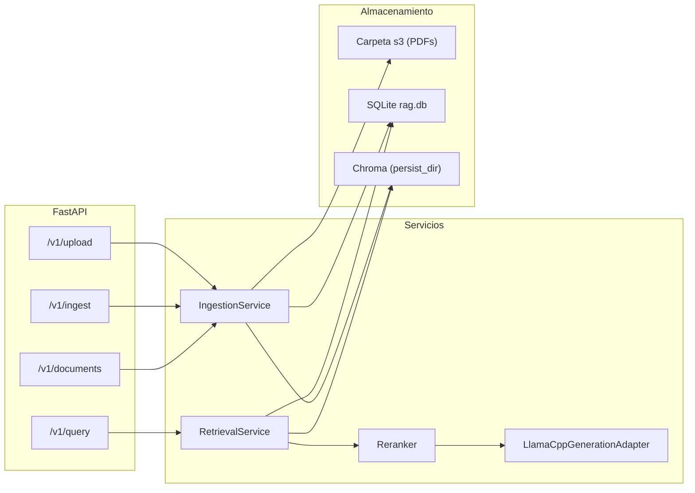
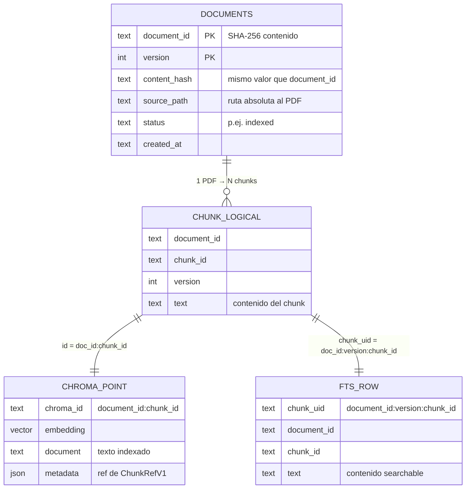
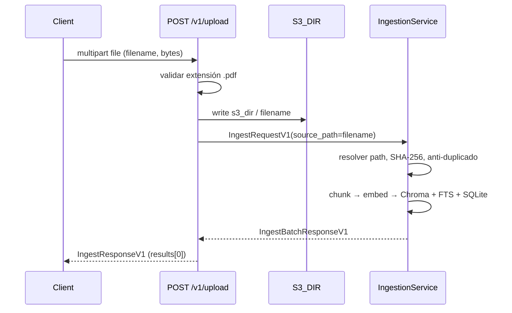
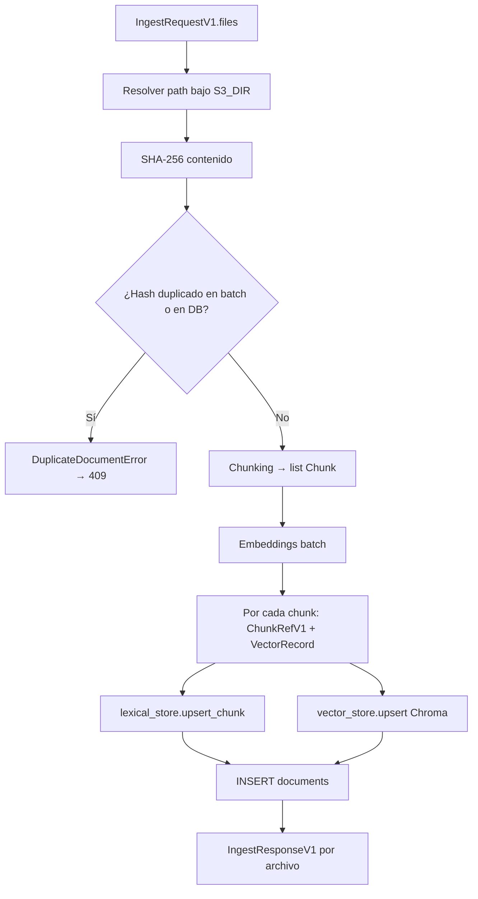
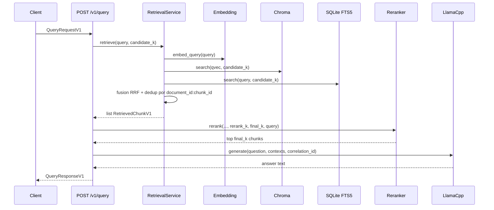

# Local RAG — Flujo del sistema, contratos y datos

Guía visual y por casos de uso: qué pasa en cada endpoint, qué variables intervienen, qué modelos Pydantic definen el contrato API, y cómo se relacionan **SQLite** (metadatos + búsqueda léxica) con **Chroma** (vectores).

---

## Vista general (componentes)

---

## Bases de datos y cómo se relacionan

Todo vive en disco según configuración (`.env` / `Settings` en `core/src/config.py`):

| Recurso | Variable típica | Rol |
|--------|------------------|-----|
| **SQLite** | `SQLITE_PATH` (ej. `./data/rag.db`) | Metadatos de documentos + índice de texto **FTS5** para palabras clave |
| **Chroma** | `CHROMA_PERSIST_DIR` + `CHROMA_COLLECTION` | Embeddings y búsqueda por **similitud semántica** |
| **Carpeta “S3” local** | `S3_DIR` (ej. `./s3`) | Copia en disco de los PDF subidos; las rutas en API son relativas a esta carpeta |

### Relación lógica (misma “entidad”: un chunk)

Un **chunk** se identifica de forma estable con:

- `document_id` — en la implementación actual coincide con el **hash SHA-256 del PDF completo** (contenido binario).
- `chunk_id` — generado al trocear (p. ej. `v1-c0001`, `v1-c0002`, …).

Ese par `(document_id, chunk_id)` es la clave que une los tres mundos:

### SQLite: tablas relevantes

1. **`documents`** — una fila por versión indexada del documento (hoy la ingesta usa `version = 1`).

2. **`chunks_fts`** (nombre configurable con `FTS_TABLE`) — tabla virtual **FTS5** con tokenizador `unicode61` por defecto. Campos **UNINDEXED** guardan metadatos (`document_id`, `chunk_id`, rutas, páginas, etc.); el campo **`text`** es el que se busca con `MATCH`.

3. **`ingestion_events`** — creada en el esquema; pensada para auditoría/eventos (la ingesta actual no la rellena en el flujo principal que viste en código; queda disponible para extensiones).

### Chroma: qué guarda cada punto

- **ID del vector**: `f"{document_id}:{chunk_id}"` (único en la colección).
- **`documents`**: texto del chunk (Chroma lo asocia al embedding).
- **`embeddings`**: vector del modelo de embeddings (`EMBEDDING_MODEL_ID`).
- **`metadatas`**: copia serializada de referencia (`document_id`, `version`, `chunk_id`, `source_path`, `source_file`, `pages` como JSON string, `first_page`, `headings` como JSON string).

La distancia en espacio vectorial se configura con `CHROMA_DISTANCE` (p. ej. `cosine` → en recuperación se usa `score ≈ 1 - distance`).

---

## Contratos API (fases y modelos)

Los tipos están en `core/src/contracts.py` (Pydantic v2). Son el **contrato estable** entre cliente (UI) y backend.

### Errores

| Modelo | Campos |
|--------|--------|
| `ApiErrorV1` | `code: ErrorCode`, `message`, `correlation_id` opcional |
| `ErrorCode` | `INVALID_REQUEST`, `GENERATION_FAILED`, `INGESTION_FAILED`, `DUPLICATE_DOCUMENT` |

### Consulta RAG

| Fase | Request | Response / piezas |
|------|---------|---------------------|
| Entrada | `QueryRequestV1`: `query`, `candidate_k`, `rerank_k`, `final_k` | Validación: `final_k ≤ rerank_k ≤ candidate_k` |
| Salida | — | `QueryResponseV1`: `answer`, `citations`, `chunks` (`ChunkRefV1[]`), `correlation_id`, `total_ms` |

Referencias por chunk: `ChunkRefV1` (`document_id`, `version`, `chunk_id`, `source_path`, `source_file`, `pages`, `first_page`, `headings`). La cita legible es `ref.citation` → `"{document_id}/{chunk_id}"`.

Internamente, antes de generar, cada candidato es un `RetrievedChunkV1` (`ref`, `text`, `score`).

### Ingesta

| Fase | Request | Response |
|------|---------|----------|
| Lote | `IngestRequestV1`: `source_path` **o** `source_paths` (mutuamente excluyentes) | `IngestBatchResponseV1` → `results: IngestResponseV1[]` |
| Por archivo | — | `IngestResponseV1`: `document_id`, `version`, `status`, `content_hash`, `created_at`, `chunks_indexed` |

### Listado de documentos

| Request | Response |
|---------|----------|
| `GET /v1/documents` (sin body) | `DocumentListResponseV1`: `documents: DocumentItemV1[]`, `total` |

---

## Caso 1: Alguien sube un PDF (`POST /v1/upload`)

Flujo resumido en la API (`core/src/api.py`):

### Variables involucradas (upload)

| Variable / campo | Origen | Significado |
|------------------|--------|-------------|
| `file.filename` | Multipart | Nombre del PDF; debe terminar en `.pdf` |
| `file` (bytes) | Multipart | Contenido escrito en disco |
| `dest` | `s3_dir / filename` | Ruta absoluta del archivo guardado |
| `req.source_path` | `file.filename` | Ruta **relativa** respecto a `S3_DIR` (lo que entiende la ingesta) |
| `content_hash` | SHA-256 del archivo | Detecta duplicados; se usa como `document_id` |
| `document_id` | = `content_hash` | Identificador lógico del documento |
| `version` | `1` (código actual) | Versión del documento en BD |
| `chunks` | `chunker.chunk(...)` | Lista interna `Chunk` con `text`, `chunk_id`, metadatos de página |
| `embeddings` | `embedding.embed_documents` | Un vector por chunk |
| Respuesta | `IngestResponseV1` | `chunks_indexed`, `status="indexed"`, etc. |

### Errores típicos

- **400**: no es PDF, path inválido, archivo no encontrado tras escribir (no debería pasar en upload normal).
- **409**: `DuplicateDocumentError` → cuerpo con `ApiErrorV1` y `DUPLICATE_DOCUMENT` si el hash ya está en `documents`.

---

## Caso 2: Ingesta por API JSON (`POST /v1/ingest`)

Mismo núcleo que el upload, pero el PDF ya debe existir bajo `S3_DIR` con la ruta relativa indicada.

- **Entrada**: `IngestRequestV1` (`source_path` o lista `source_paths`).
- **Salida**: `IngestBatchResponseV1` con un `IngestResponseV1` por archivo.

### Fases internas de ingesta (contrato “de dominio”, no HTTP)

---

## Caso 3: Listar documentos (`GET /v1/documents`)

1. Lee filas de `documents` en SQLite (orden `created_at DESC`).
2. Mapea a `DocumentItemV1` (el API expone `source_file` como **solo el nombre** del archivo, no la ruta completa).

---

## Caso 4: Pregunta al RAG (`POST /v1/query`)

### Variables involucradas (query)

| Variable | Rol |
|----------|-----|
| `req.query` | Texto de la pregunta |
| `req.candidate_k` | Cuántos candidatos tras fusión semántica + léxica (RRF) |
| `req.rerank_k` | Cuántos entran a la fase de rerank (cross-encoder si está habilitado, si no se usan scores RRF) |
| `req.final_k` | Cuántos chunks pasan a contexto del LLM (tras MMR) |
| `qvec` | Embedding de la pregunta |
| `semantic` / `lexical` | Listas `RetrievedChunkV1` desde Chroma y FTS |
| `correlation_id` | UUID por request (trazas y errores de generación) |
| `contexts` | `list[tuple[ChunkRefV1, str]]` enviado al modelo |
| Respuesta | `answer`, `citations` (`document_id/chunk_id`), `chunks`, tiempos |

### Contrato interno de recuperación

- **Entrada**: `query: str`, `candidate_k: int`.
- **Salida**: `list[RetrievedChunkV1]` ordenada por **RRF** (Reciprocal Rank Fusion) con parámetro `rag_rrf_k` (`RAG_RRF_K`). Los chunks presentes en **ambos** canales suelen subir en el ranking.
- **Umbral opcional**: `rag_semantic_threshold` filtra resultados semánticos con `score` bajo (el `score` en Chroma viene de `1 - distance` en espacio configurado).

### Rerank

- **Entrada**: candidatos ya ordenados por RRF, `rerank_k`, `final_k`, `query`.
- Si `cross_encoder_enabled` y hay modelo cargado: re-puntúa pares `(query, texto)` y aplica **MMR** (`mmr_lambda`) para diversidad.
- Si no: usa el `score` que ya traía cada `RetrievedChunkV1` (RRF) y aplica MMR igualmente.

### Generación

- **Entrada**: `question`, `contexts` (citas truncadas en prompt a ~400 caracteres por evidencia), `correlation_id`.
- **Salida**: `str` (texto del modelo).
- **Error**: `GenerationError` → HTTP 500 con `ApiErrorV1` (`GENERATION_FAILED`).

---

## Resumen rápido: de dónde sale cada pieza de la respuesta

| Campo en `QueryResponseV1` | Origen |
|----------------------------|--------|
| `answer` | LLM local (llama.cpp) |
| `citations` | `chunk.ref.citation` de los chunks finales |
| `chunks` | Metadatos `ChunkRefV1` de esos mismos chunks |
| `correlation_id` | Generado en el handler de `/v1/query` |
| `total_ms` | Suma instrumentada (retrieval + rerank + generation) |

---

## Archivos de referencia en el repo

| Tema | Ubicación |
|------|-----------|
| Contratos API | `core/src/contracts.py` |
| Rutas HTTP | `core/src/api.py` |
| Ingesta y SQLite `documents` | `core/src/rag/ingestion.py` (según layout actual del paquete) |
| Chroma | `core/src/stores/vector_store.py` |
| FTS5 | `core/src/stores/lexical_store.py` |
| Recuperación híbrida | `core/src/rag/retrieval.py` |
| Rerank MMR / cross-encoder | `core/src/rerank.py` |
| Generación | `core/src/rag/generation.py` |
| Config y paths | `core/src/config.py` |
| Ensamblado de la app | `core/main.py` |

Si tu árbol de imports usa `src.ingestion` en lugar de `src.rag.ingestion`, la lógica descrita es la misma; solo cambia la ruta del módulo.

---

*Documento generado para el proyecto Local RAG; alinear con el código ante refactors de paquetes.*
